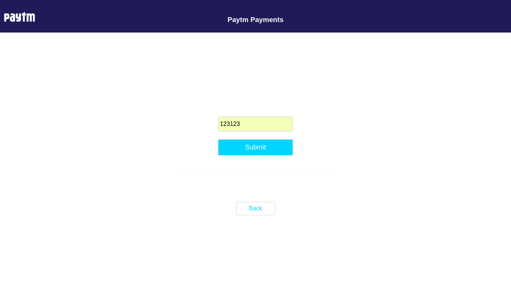

# PPG-testing

# Description
This model implements the Paytm's Payment Gateway in a nodejs application. This project has two routes, one from where the payment is initiated and the other is confirmation page showing the response of the payment gateway.
In-Between these two routes, the user interacts with the Paytm's web page (where user selects the mode of payment) and then with the Bank's authorisation page (where user performs the authorisation for the Bank's page).
This completes the transaction and its status is shown to the end-user from the merchants side (in case of a local machine, its localhost).

# Installation/Manual Setup
## Prerequisites
* paytm account
* paytm developer 'merchantid', 'secret key' or 'key'
* git (only if you plan to clone and make changes, to maintain the different versions)
* node (node package installed on the machine)
* text editor

## Steps to setup
- Clone/[download](https://github.com/Ujjwal0501/PPG-testing/archive/master.zip) this repository
- Change your working directory to the cloned directory (or extracted directory)

*note:- at this point, your present working directory should have the required files (to see the directory structure view [image](https://github.com/Ujjwal0501/PPG-testing/blob/master/tree.png))*
*note:- following steps should be performed from the project directory*

- Install nodejs dependencies using the following command `npm install`

At this point, we are ready to host the server on the local machine
- To start the server, use the following command in terminal `nodemon`

## Screenshots (for Debit card mode of payment)

